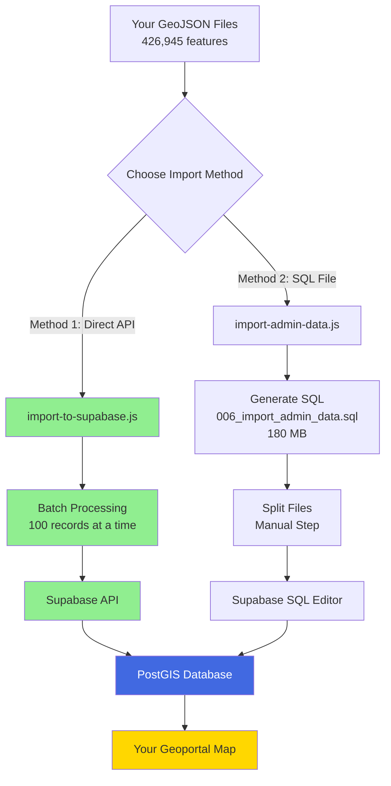
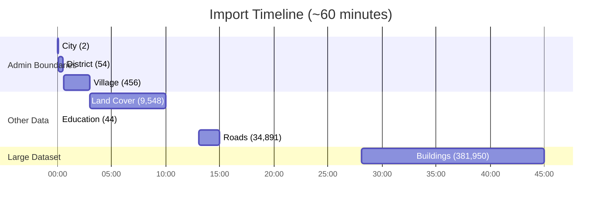
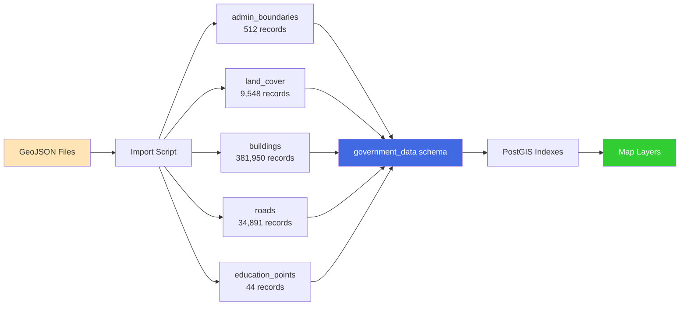

# 🗺️ Admin Data Import - Visual Guide

## 📊 Data Flow Diagram



## 📁 File Structure

```
C:\Users\acer\kediri-geoportal\
│
├── data/government/fix/           ← YOUR DATA (426,945 features)
│   ├── administrasi_ar_kabkota.geojson      (2 features)
│   ├── administrasi_ar_kecamatan.geojson    (54 features)
│   ├── administrasi_ar_desakel.geojson      (456 features)
│   ├── land_cover.geojson                   (9,548 features)
│   ├── bangunan_ar.geojson                  (381,950 features) ⚠️ LARGE
│   ├── jalan_ln.geojson                     (34,891 features)
│   └── pendidikan_pt.geojson                (44 features)
│
├── scripts/                       ← IMPORT SCRIPTS (NEW)
│   ├── import-admin-data.js       (Generates SQL file)
│   └── import-to-supabase.js      (Direct API import) ⭐
│
├── database/migrations/
│   ├── 001_create_schemas.sql
│   ├── 002_create_government_tables.sql
│   ├── 003_create_crowd_tables.sql
│   ├── 004_create_rls_policies.sql
│   ├── 005_create_triggers.sql
│   └── 006_import_admin_data.sql  ← GENERATED (180 MB)
│
├── IMPORT_DATA_GUIDE.md           ← DOCUMENTATION (NEW)
├── QUICK_IMPORT.md                ← QUICK REFERENCE (NEW)
└── README.md                      ← UPDATED
```

## 🎯 Import Process Timeline



## 🗄️ Database Schema Mapping



## 📈 Data Distribution

```
Total Features: 426,945

Buildings:        381,950  ████████████████████████████████████████ 89.5%
Roads:             34,891  ███                                       8.2%
Land Cover:         9,548  ██                                        2.2%
Villages:             456  ▏                                         0.1%
Districts:             54  ▏                                         0.01%
Education:             44  ▏                                         0.01%
City:                   2  ▏                                         0.001%
```

## 🔄 Field Mapping Examples

### Admin Boundaries (Indonesian → English)

```
GeoJSON (Indonesian)          Database (English)
┌─────────────────────┐      ┌──────────────────┐
│ NAMOBJ              │ ───→ │ name             │
│ WADMKK/WADMKC/WADMKD│ ───→ │ name             │
│ KDCBPS/KDCPUM/KDCKEL│ ───→ │ code             │
│ JUMLAH_PE           │ ───→ │ population       │
│ REMARK              │ ───→ │ description      │
│ geometry            │ ───→ │ geom (PostGIS)   │
└─────────────────────┘      └──────────────────┘
```

### Land Cover

```
GeoJSON                Database
┌─────────────┐       ┌─────────────────┐
│ NAMOBJ      │ ───→  │ name            │
│ KELAS       │ ───→  │ land_type       │
│ LUASHA      │ ───→  │ area_hectares   │
│ REMARK      │ ───→  │ description     │
│ geometry    │ ───→  │ geom            │
└─────────────┘       └─────────────────┘
```

### Roads

```
GeoJSON                Database
┌─────────────┐       ┌─────────────────┐
│ NAMRJL      │ ───→  │ name            │
│ FCODE       │ ───→  │ road_type       │
│ PERMKL      │ ───→  │ surface         │
│ PANJANG     │ ───→  │ length_meters   │
│ REMARK      │ ───→  │ description     │
│ geometry    │ ───→  │ geom            │
└─────────────┘       └─────────────────┘
```

## 🚀 Quick Command Reference

### Install Dependencies
```cmd
npm install
```

### Run Import (Recommended)
```cmd
node scripts/import-to-supabase.js
```

### Generate SQL File (Alternative)
```cmd
node scripts/import-admin-data.js
```

### Verify Import
```sql
SELECT 
  'admin_boundaries' as table_name, 
  COUNT(*) as records 
FROM government_data.admin_boundaries
UNION ALL
SELECT 'land_cover', COUNT(*) FROM government_data.land_cover
UNION ALL
SELECT 'buildings', COUNT(*) FROM government_data.buildings
UNION ALL
SELECT 'roads', COUNT(*) FROM government_data.roads
UNION ALL
SELECT 'education_points', COUNT(*) FROM government_data.education_points;
```

### Start Dev Server
```cmd
npm run dev
```

## ✅ Success Checklist

```
Before Import:
☐ Database migrations 001-005 completed
☐ .env file configured
☐ npm install completed
☐ ~60 minutes available

During Import:
☐ Monitor console output
☐ Check for errors
☐ Wait for completion message

After Import:
☐ Verify record counts in Supabase
☐ Test map layers
☐ Check geometry rendering
☐ Verify attribute data
```

## 🎯 Expected Results

### Supabase Table Editor

```
government_data schema:
├── admin_boundaries     [512 rows]     ✓
├── land_cover          [9,548 rows]    ✓
├── buildings           [381,950 rows]  ✓
├── roads               [34,891 rows]   ✓
└── education_points    [44 rows]       ✓
```

### Map Interface

```
Layer Control:
├── 🗺️ Administrative Boundaries
│   ├── City (Kediri)
│   ├── Districts (54)
│   └── Villages (456)
├── 🌳 Land Cover (9,548)
├── 🏢 Buildings (381,950)
├── 🛣️ Roads (34,891)
└── 🎓 Education (44)
```

---

**Ready to import? Run:** `node scripts/import-to-supabase.js`
